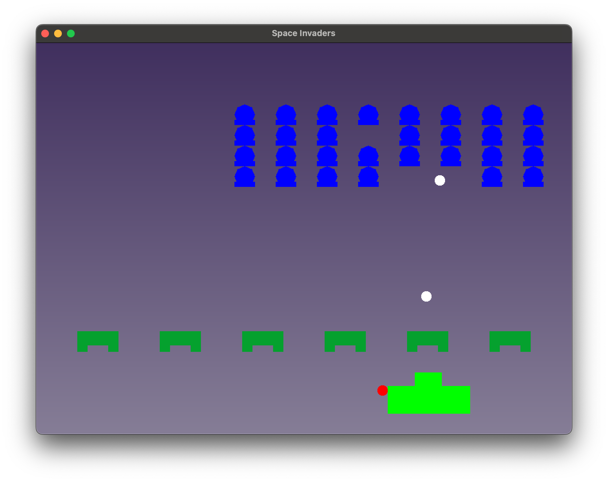

# Space Invaders
This C++ project is a clone of Taito's classic game, Space Invaders, made using the SFML Engine(https://www.sfml-dev.org).
This project is different to my previous ones, as it has dynamic NPCs, as in this game there are moving enemy characters that fire bullets at the player character.



## Building and Running
To compile the project, follow these simple steps:
```
$ make all

$ ./invaders
```

## Credits

I'd like to acknowledge the following creators, as the font used for the game over text and the sound effect are not created by me:

- **Font:** "Public Pixel Font" designed by GGBotNet (https://www.fontspace.com/public-pixel-font-f72305).
- **Sound effects:** Crafted by krial (https://opengameart.org/content/siclone-sound-effects).
